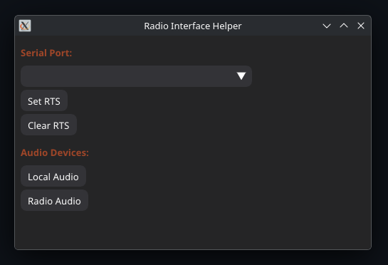

# Radio Interface Helper UI

Python + ImGui UI for doing some *really* basic tasks for a connected radio transceiver.

This is a personal project with lots of hardcoded stuff.

It *might* be useful for someone to take some code from.



## Features

* Set and Clear RTS flag on serial port
* Swap default desktop audio devices

## Requirements

* Linux
* Python3
* UV
* Wire Plumber Audio

## Installing

```bash
git clone https://github.com/mdavey/radio-interface-helper-ui.git
cd radio-interface-helper-ui/
```

## Configuring

You **will** need to edit `main.py` for audio switching.

You can get a list of all audio devices on your system via:

* `uv run src/pipewiredump.py`  or
* `wpctl status --name`

Then change these values to match your setup:

```python
DefaultAudioDevice = AudioDeviceDefinition(
    sink          = 'alsa_output.usb-miniDSP_miniDSP_2x4HD-00.analog-stereo',
    source        = 'alsa_input.usb-ARTURIA_MiniFuse_2_8840400501033904-00.HiFi__Line3__source',
    sink_volume   = 0.5,
    source_volume = 1.0
)

RadioAudioDevice = AudioDeviceDefinition(
    sink          = 'alsa_output.usb-C-Media_Electronics_Inc._USB_Audio_Device-00.analog-stereo',
    source        = 'alsa_input.usb-C-Media_Electronics_Inc._USB_Audio_Device-00.mono-fallback',
    sink_volume   = 0.7,
    source_volume = 0.38
)
```

## Running

```bash
uv run main.py
```